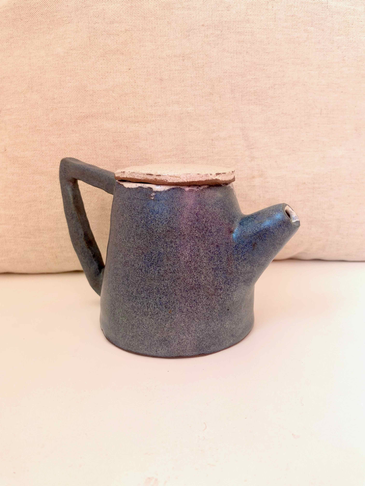
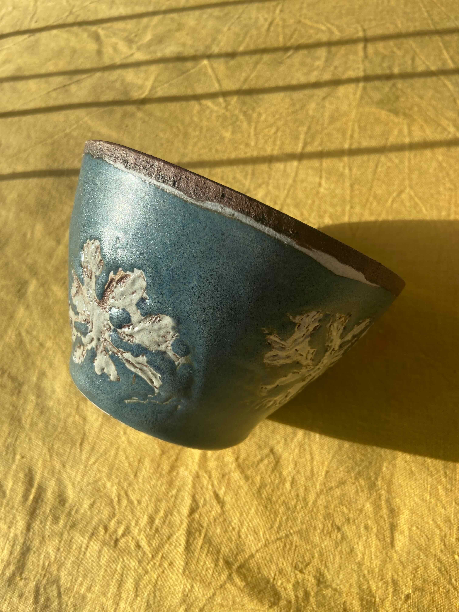
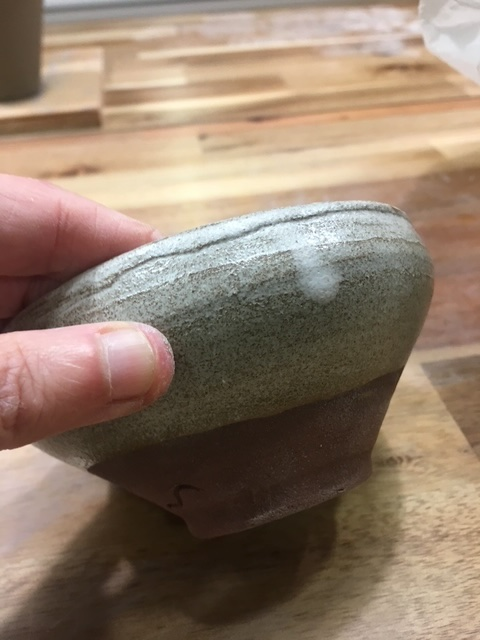
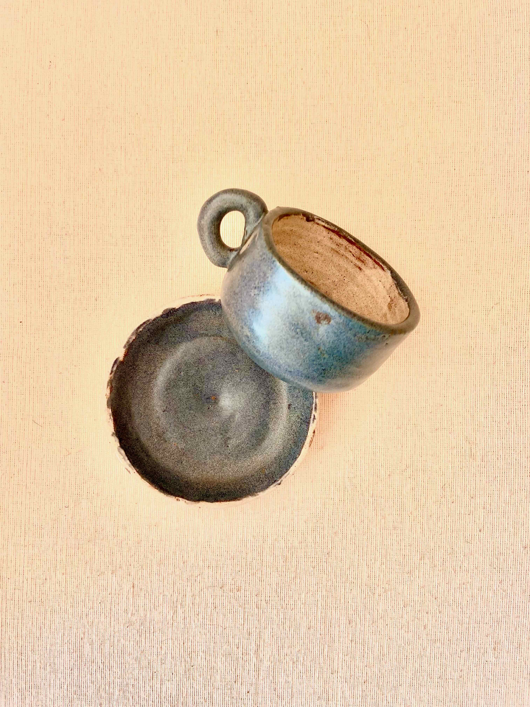
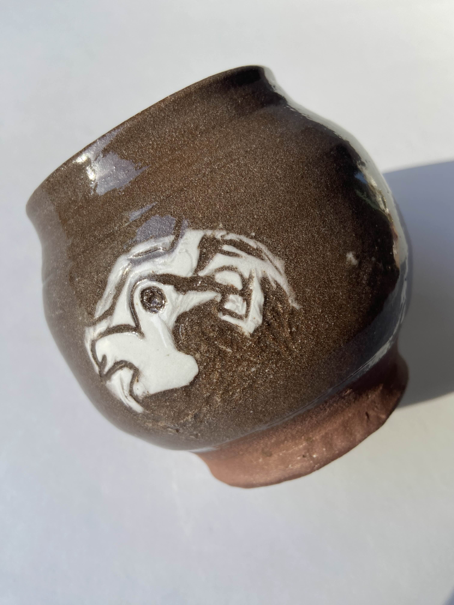

# The Pieces

In these pages you can see some of my pieces. There aren't many, but they are quite distinct.

## Blue Teapot

**Material:** Buño clay, porcelain, Mayco FN-006 blue glaze
**Size:** 24 cm high x 18 cm wide, 14 cm diameter
**Weight:** 1,050 grams
**Color:** blue glaze on the outside, white porcelain on the inside

Heat resistant. Microwave and dishwasher safe, but do not place directly over an open flame.

This teapot is inspired by Fauvist paintings, with bright colors and straight lines.

---

## Blue Cunca (Bowl)

**Material:** Buño clay, porcelain, Mayco FN-006 blue glaze
**Size:** 8 cm high x 13 cm wide, 13 cm diameter
**Weight:** 320 grams
**Color:** blue glaze on the outside, white porcelain interior and decoration

Heat resistant. Microwave and dishwasher safe, but do not place directly over an open flame.

Made with the same glaze and technique as the teapot, except in this case, the piece was dipped in porcelain first, then the design was carved, and finally glazed blue.

The shape is based on the cunca, used for broth. The design came from watching seaweed while diving. The top section is left unpainted to show the clay, but it is glazed.

---

## White Cunquelo (Small Cup)

**Material:** Buño clay, Mayco FN-001 white glaze
**Size:** 7 cm high x 9 cm wide, 9 cm diameter
**Weight:** 180 grams
**Color:** white with exposed Buño clay sections

Heat resistant. Microwave and dishwasher safe, but do not place directly over an open flame.

This piece is based on the original shape of the cunquelo, a small, handleless cup used for drinking wine. The shape feels a bit medieval.

---

## Blue Cup and Saucer Set

 

**Material:** Buño clay, Mayco FN-006 blue glaze, Mayco FN-001 white glaze
**Size:** cup 9 cm high *(details to complete)*

---

## Alondra Cup

**Material:** Buño clay, porcelain slip decoration **Size:** *(add measurements)* **Weight:** *(add weight)* **Color:** dark glaze with white porcelain-slip bird and starburst decoration

Heat resistant. Microwave and dishwasher safe, but do not place directly over an open flame.

A bird on one side, two starbursts as you turn the piece — drawn freehand with liquid porcelain onto the still-soft clay, no stencil. Thrown in one piece. Inspired by the moon jar tradition and Soetsu Yanagi's *mingei* philosophy: beauty in handmade, everyday objects, not display pieces. No two are exactly alike.

[← Back home](index.md) · [See the process →](process.md)
